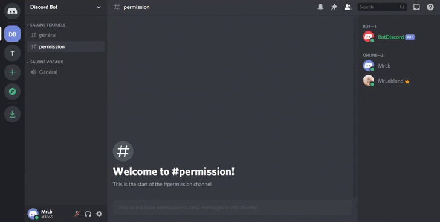

# admin-discord-bot
This is a discord bot to (rule them all) automatically administer member roles via reactions.

## Origins
This project idea was born during French lockdown, I was bored to manually manage our members' roles on discord, and saw 
some MEE6 & others great bots that can do what I wanted. But we are regarding about where and by who our data are 
managed, so we would an on-premise solution, and I'm also curious to develop a kotlin bot.

## Features
Many features composes this bot:
* Autofill permission message (from the administrator) with requested reactions.
* Delete bad (not requested) reactions added on a permission message.
* Add or remove a role to a member based on their reactions to a permission message.
* Add or remove member as bot administrator.

## Example



## Installation
_Coming soon_

**Build**

Get sources
```shell script
git clone git@github.com:GBenoitG/admin-discord-bot.git  && cd admin-discord-bot/
```

Build sources
```shell script
docker build -t discord-bot .
```

**Initialization**
```shell script
docker run --rm -v $(pwd):/home/gradle/src admin-bot run --args="init"
```
Edit the `properties.json` file freshly created ([seen here](#properties)) with your Discord Api Key then your discord 
administrator, and what ever you need to edit.

**Run**
```shell script
docker run --restart unless-stopped -d -v $(pwd):/home/gradle/src admin-bot run
```

## Documentation
All the details coming soon in the [Wiki](https://github.com/GBenoitG/admin-discord-bot/wiki)
### Properties
There is an automatically generated `properties.json` at the first start: 
```json
{
    "token": "[YOUR_DISCORD_BOT_TOKEN]",
    "prefix": "$",
    "allowed_roles_list": [
        "[ANY_ROLE_NAME]",
        "Administrator"
    ],
    "allowed_users_id_list": [
        "[ANY_MEMBER_ID]"
    ]
}
```

* `token` put your own discord bot token [get from developer console](https://discord.com/developers/applications).
* `prefix` you can change the prefix if needed, by default it's set to `$`.
* `allowed_roles_list` contains a list of names of roles that can use the bot.
* `allowed_users_id_list` same as before, but instead it's all ID from members who can use the bot.

### Commands

* `[PREFIX]permission [CONTENT]` the structure of the content is very specific:
```
[DESCRIPTION_MESSAGE] : 
- :[EMOJI_NAME]: #[CHANNEL_NAME]
- :[EMOJI_NAME_2]: #[CHANNEL_NAME_2]
...
```
For example: (cf: 1st [example](#example))
```
$permission Here we are, folks! Let's join your favorite channels by reacting with the right emojis : 
- :video_game: #game
- :keyboard: #dev
- 🎉 #party
```
Unicode Emoji are supported.

* `[PREFIX]op @[MEMBER]`, same with `deop`.
Useful if you want allow someone or not to use the bot.

For example:
```
$op @JohnDoe
...
$deop @JohnDoe
```

# License
Based on [GNU GPL v3.0](LICENSE).
